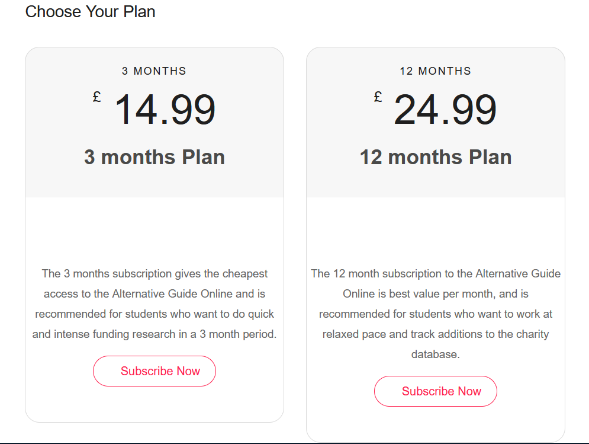

# Postgraduate Funding Platform (AGO CMS)

A full-stack web platform developed to support **The Alternative Guide to Postgraduate Funding Online (AGO)** used by postgraduate students across UK universities.

The system enables students to discover **scholarships, grants, and charity-based funding opportunities**, while providing administrators with a **complete CMS dashboard for managing content, menus, users, and subscriptions**.

---

# 🚀 Key Features

- Postgraduate funding discovery platform
- Subscription-based access system
- PayPal payment integration
- CMS-driven navigation system
- University-based authentication
- PIN-based access system
- IP-based institutional access
- Admin analytics dashboard
- Content management system

---

# 🛠 Technology Stack

Backend:
- PHP
- CodeIgniter Framework
- MySQL

Frontend:
- HTML
- JavaScript
- jQuery
- Bootstrap

Integrations:
- PayPal Payment Gateway

---

# 📸 Platform Screenshots

The following screenshots demonstrate key features of the platform.

---

## Admin Dashboard

The administration panel provides real-time analytics for the platform.

Features:
- Total users
- Active users
- Total subscriptions
- Active subscriptions
- University subscriptions
- Access type statistics

---

## CMS Menu Management

Administrators can dynamically manage the entire site navigation using a **CMS-based menu system**.

Features:
- Dynamic navigation
- Nested menu structure
- Menu visibility control
- CMS-driven frontend navigation

---

## Website Navigation Menu

The website navigation is dynamically generated from the CMS database using a **recursive menu rendering system**.

Features:
- Multi-level menus
- Dynamic menu generation
- Role-based access visibility
- Clean frontend navigation

---

## Subscription Plans

Users can subscribe to access the funding database.

Available plans:

- **3 Month Plan**
- **12 Month Plan**

Features:
- PayPal payment processing
- Coupon system
- Automatic subscription activation
- Secure checkout flow

---

# ⚙️ System Modules

### Content Management
- Content manager
- Menu manager
- Cover image management
- Resource management
- PDF mode management

### User Management
- User manager
- Email access management
- PIN access management
- IP access management
- University management

### Subscription System
- Plan management
- PayPal integration
- Subscription lifecycle
- Coupon support

### Analytics Dashboard
- Active users monitoring
- Subscription statistics
- Institutional access tracking

---

### Controllers
Application logic including:

- Product subscriptions
- Payment processing
- User management workflows

### Models
Database interaction and business entities.

### Libraries
Custom integrations such as:

- PayPal payment processing library

### Views
Frontend templates for:

- Dashboard
- Navigation
- Product subscription pages

---

---

# 📦 Example Code Demonstrated

This repository demonstrates:

- Recursive menu generation
- PayPal payment integration
- Subscription lifecycle management
- CMS-driven navigation
- MVC architecture with CodeIgniter

---

# 📄 License

This repository is shared for **portfolio and demonstration purposes only**.  
Production credentials and proprietary infrastructure have been removed.

---

# 👨‍💻 Author

**Md. Ashikur Rahman**

Senior Software Engineer  

GitHub:  
https://github.com/ashikur-rahman

